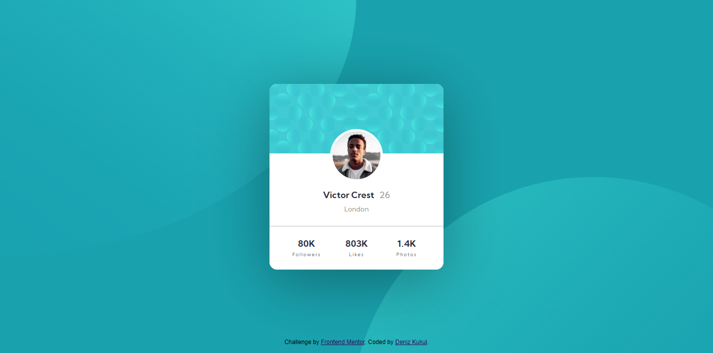

# Frontend Mentor - Profile card component solution

This is a solution to the [Profile card component challenge on Frontend Mentor](https://www.frontendmentor.io/challenges/profile-card-component-cfArpWshJ). Frontend Mentor challenges help you improve your coding skills by building realistic projects. 

## The challenge

- Build out the project to the designs provided

## Screenshot

## Links

- Solution URL: [https://github.com/denizkukul/frontendmentor-challenges/tree/main/profile-card-component](https://github.com/denizkukul/frontendmentor-challenges/tree/main/profile-card-component)
- Live Site URL: [https://frontendmentor-profile-card-component-challenge.netlify.app/](https://frontendmentor-profile-card-component-challenge.netlify.app/)

## Built with

- HTML
- CSS Media Queries
- Flexbox

