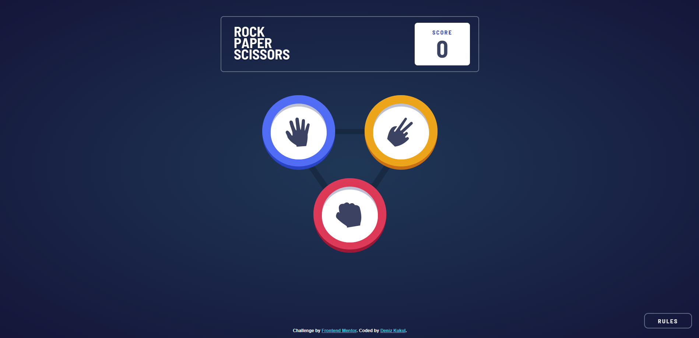

# Frontend Mentor - Rock, Paper, Scissors solution

This is a solution to the [Rock, Paper, Scissors challenge on Frontend Mentor](https://www.frontendmentor.io/challenges/rock-paper-scissors-game-pTgwgvgH). Frontend Mentor challenges help you improve your coding skills by building realistic projects. 

### The challenge

Users should be able to:

- View the optimal layout for the game depending on their device's screen size
- Play Rock, Paper, Scissors against the computer
- Maintain the state of the score after refreshing the browser _(optional)_
- **Bonus**: Play Rock, Paper, Scissors, Lizard, Spock against the computer _(optional)_

### Screenshot

### Links

- Solution URL: [https://github.com/denizkukul/frontendmentor-challenges/tree/main/rock-paper-scissors-game](https://github.com/denizkukul/frontendmentor-challenges/tree/main/rock-paper-scissors-game)
- Live Site URL: [https://frontendmentor-rock-paper-scissors-game-challenge.netlify.app/](https://frontendmentor-rock-paper-scissors-game-challenge.netlify.app/)

### Built with

- HTML
- CSS Media Queries
- Flexbox
- Javascript